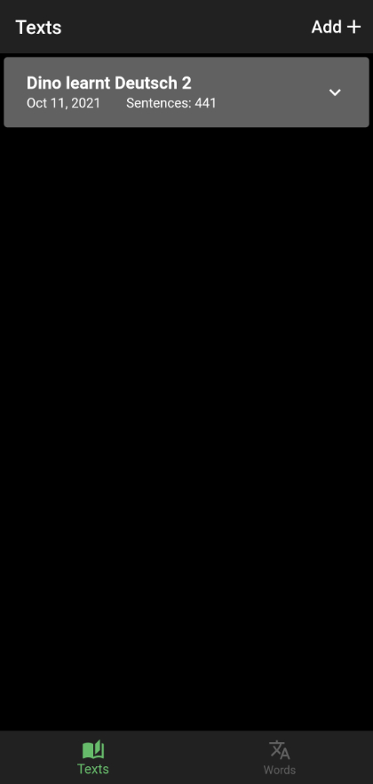
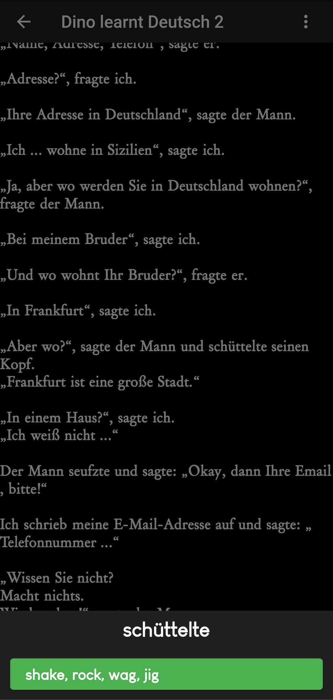
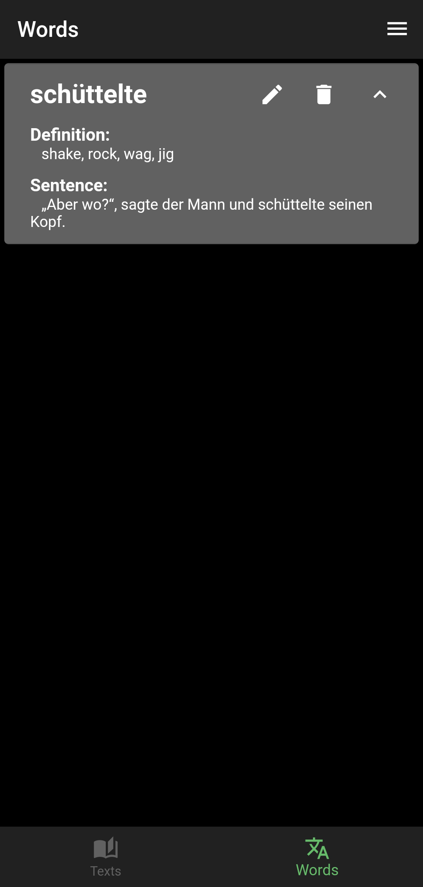

# Language Miner

Language Miner is a simple app to help with learning language(currently only german).

## Main features

* Local dictionary
* Reading looked up words with text to speech
* Saving looked up words with their sentence and definition
* Export to .tsv file for import into Anki

## Screenshots

## Reading features

* Font size
* Padding size
* 3 fonts
* Tts (reading selected word on tap or sentence on long press)

